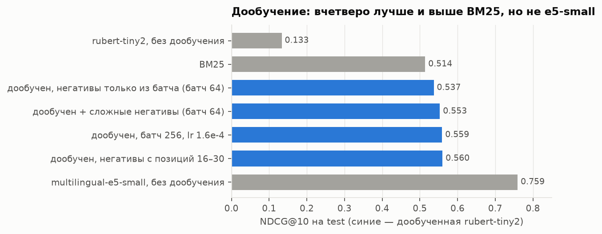
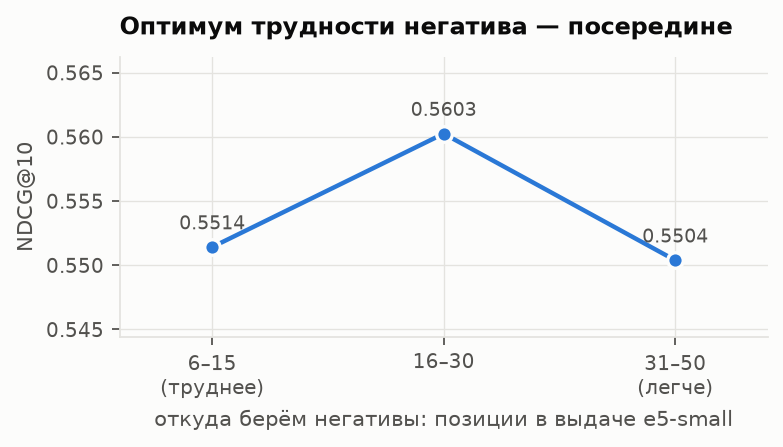
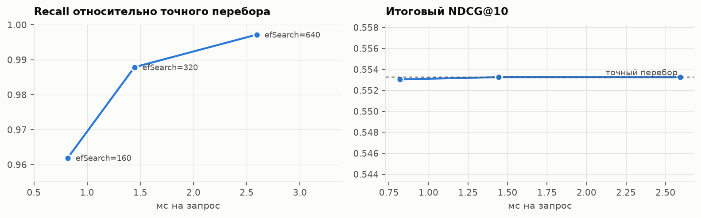

# Семантический поиск: свой эмбеддер под домен и LLM-судья

Мотивация бытовая: несколько тысяч сохранённых статей и заметок на русском, в которых ничего нельзя
найти — помнишь смысл, а не формулировку. Готовые эмбеддеры отвечают на вопрос «похожи ли два
текста», а поиску нужен другой — «есть ли в тексте ответ». Значит, модель надо дообучать, а для
этого нужны размеченные пары «запрос — правильный документ». Отсюда два вопроса проекта:

1. **сколько на самом деле даёт дообучение маленького эмбеддера под задачу поиска;**
2. **можно ли доверить разметку языковой модели** (LLM-as-a-judge) — с числом согласия с людьми.

Стенд — русская часть [MIRACL](https://arxiv.org/abs/2210.09984): вопросы к статьям Википедии и
абзацы, размеченные асессорами, причём и релевантные, и проверенно нерелевантные пары.

Весь код и выводы — в [`semantic_search.ipynb`](semantic_search.ipynb). Всё считалось на одном
MacBook (Apple Silicon, 16 ГБ).

**Стек:** Python, PyTorch, sentence-transformers (дообучение `rubert-tiny2`, кросс-энкодер),
`bm25s`, hnswlib, Ollama (`qwen2.5:7b` как судья), pandas. Метрики, майнинг негативов, бутстреп и
каппа Коэна написаны вручную.

## Коротко

- **Дообучение окупается:** `rubert-tiny2` на 10 тысячах пар — NDCG@10 **0.133 → 0.560**, вчетверо,
  и значимо выше BM25 (0.514). Одно обучение — от двух до десяти минут на ноутбуке: дорого стоит
  разметка, а не вычисления.
- **Но не заменяет предобучение:** готовая `multilingual-e5-small` без всякого дообучения — **0.759**.
  Практический вывод — брать сильную готовую модель и доучивать её, а не тянуть маленькую.
- **Слишком трудные негативы вредят.** Негативы, проверенные человеком, обучили *хуже* подобранных
  автоматически — не из-за ошибок разметки, а потому что они труднее. Кривая «трудность — качество»
  — перевёрнутая парабола с оптимумом в середине выдачи.
- **Эксперимент с размером батча был поставлен неправильно** и дал результат против литературы;
  после поправки на число шагов оптимизатора зависимость стала чистой и монотонной.
- **Реранкер на трёхслойной модели не учится вообще;** та же постановка на 12-слойной e5-small
  учится — дело в ёмкости.
- **LLM-судье пока рано доверять разметку:** каппа Коэна с асессорами 0.48, после правки промпта
  по матрице ошибок — 0.51. Умеренное согласие, примерно каждая четвёртая метка мимо.

## Стенд

- **Мини-корпус.** Полный русский корпус MIRACL — 9.5 млн абзацев, на ноутбуке не живёт. Взяты все
  41 тысяча размеченных документов и 109 тысяч случайных для фона — 150 тысяч. Задача от этого
  стала легче: BM25 даёт 0.514 против 0.334, опубликованных для полного корпуса. Поэтому строки
  внутри проекта сравнимы между собой, а с публичным лидербордом — нет.
- **Запросы разделены раз и навсегда:** 4683 на обучение, 299 на подбор настроек, 947 на
  финальный замер. Шесть dev-запросов слово в слово совпали с обучающими — выкинуты.
  Негативы майнятся только по обучающим запросам.
- **Метрики** (NDCG@10, MRR@10, Recall@k) написаны руками и сверены со sklearn и ручным счётом.
  Каждое важное сравнение — с **парным бутстрепом** по запросам: разницы здесь часто в третьем знаке.

## Результаты

Тестовые запросы (947), один и тот же мини-корпус.

| | Recall@10 | NDCG@10 | MRR@10 |
|---|---|---|---|
| `rubert-tiny2` без дообучения | 0.180 | 0.133 | 0.161 |
| BM25 | 0.650 | 0.514 | 0.540 |
| дообучена, негативы только из батча (батч 64) | 0.670 | 0.537 | 0.590 |
| + сложные негативы (батч 64) | 0.687 | 0.553 | 0.606 |
| негативы только из батча, батч 256 | 0.704 | 0.559 | 0.603 |
| **сложные негативы с позиций 16–30** | 0.699 | **0.560** | 0.609 |
| `multilingual-e5-small` без дообучения | 0.883 | 0.759 | 0.791 |



По бутстрепу: негативы только из батча при батче 64 дают +0.023 к BM25 — в пределах шума;
сложные негативы добавляют +0.016 (значимо); лучший вариант выше BM25 на +0.046, 95% интервал
[+0.021; +0.070].

## Что двигает качество

**Размер батча.** В MNRL-лоссе (InfoNCE) негативами для запроса служат позитивы остальных запросов
батча, так что ожидание — «больше батч, лучше». При фиксированном learning rate вышло наоборот
(0.539 / 0.537 / 0.532 для батчей 16 / 64 / 128). Причина в постановке: при фиксированном числе эпох
большой батч получает пропорционально меньше шагов оптимизатора. С learning rate, масштабированным
линейно вместе с батчем, зависимость чистая: **0.510 → 0.537 → 0.543 → 0.550 → 0.559** для батчей
16 / 64 / 96 / 128 / 256. Совместить большой батч со сложными негативами не удалось — не влезло
в память.

**Какие негативы.** Гипотеза была, что негативы, проверенные асессором, обучают лучше подобранных
автоматически: среди последних есть ложные (например, статья про Ли Харви Освальда в негативах к
вопросу о предполагаемом убийце Кеннеди). Вышло наоборот: 0.501 против 0.540, значимо. Объяснение
«они просто легче» тоже не подтвердилось — человеческие негативы **труднее** (медианная позиция в
выдаче 7 против 9, в топ-10 — 73% против 58%). Обычно эффект «слишком трудные негативы вредят» не
отделить от того, что среди них прячутся неразмеченные правильные ответы; здесь негативы проверены
человеком, так что остаётся сама трудность. Одна точка превращена в кривую:



Негативы с позиций 6–15 слишком трудные, с 31–50 слишком лёгкие; обе разницы с серединой значимы.

## Второй этаж поиска

**Кросс-энкодер-реранкер** (запрос и документ читаются вместе) поверх топ-50 не обучился: финальный
лосс совпал с энтропией априорного распределения (0.502 против 0.500 при доле позитивов 0.2), и
после переранжирования NDCG@10 упал с 0.553 до 0.141. Проверка развела две версии — «мало данных» и
«мало ёмкости»: `rubert-tiny2` запоминает свои пары вплоть до AUC 1.0, но на отложенных застревает
около 0.6; 12-слойная `e5-small` на тех же данных выходит на 0.82. Дело в ёмкости.

**HNSW.** На 150 тысячах документов точный перебор батчем на ускорителе (0.33 мс на запрос)
быстрее индекса; по одному запросу на CPU — наоборот, 7.2 мс против 0.8 мс. Главное: при
настройке, теряющей 4% ближайших соседей, итоговый NDCG@10 не меняется (0.5530 против 0.5533) —
теряются документы с хвоста. На большом корпусе за скорость можно платить точностью индекса
почти бесплатно.



## LLM-судья

`qwen2.5:7b` (Q4_K_M) через локальный Ollama, `temperature=0`, ответ по JSON-схеме, рубрика на
четыре градации. Проверка — 600 пар из valid: 300 релевантных и 300 нерелевантных, которые асессор
посмотрел и забраковал, то есть близких по теме.

| промпт | каппа Коэна | accuracy | ложно релевантных | пропусков |
|---|---|---|---|---|
| v1, простой | 0.480 | 0.740 | 63 | 93 |
| v2, по разбору ошибок | 0.513 | 0.757 | 82 | 64 |

Разбор ошибок первой версии дал две закономерности. Ложные срабатывания — путаница объектов: судья
находит фразу, которая по форме отвечает на вопрос, и не проверяет, про тот ли она объект («когда
день города в Калуге» — статья про Калуш). Пропуски — требование дословности. Длина текста, на
которую падало подозрение, ни при чём. Вторая версия промпта сначала требует проверить объект и
разрешает неявные ответы: каппа выросла, судья стал решительнее (оценка «частично» почти исчезла),
но в зоне умеренного согласия так и остался. На замену асессору такой судья пока не годится.

## Что осталось незакрытым

- реранкер на `e5-small` поверх выдачи и сравнение pointwise / pairwise / listwise лоссов;
- большой батч вместе со сложными негативами — нужна машина с памятью побольше;
- судья на test и его дистилляция в маленький кросс-энкодер;
- дообучение `e5-small` вместо `rubert-tiny2`, перемайнинг негативов дообученной моделью (ANCE),
  обучение на скорах учителя (MarginMSE).

## Структура

```
semantic_search.ipynb   весь код и выводы: данные, метрики, бейзлайны, майнинг, дообучение,
                        реранкер, HNSW, LLM-судья, разбор ошибок
results/                все посчитанные числа (JSON): метрики, поквериный NDCG, логи обучения,
                        оценки судьи; по ним строятся таблицы и графики
figures/                графики из ноутбука
requirements.txt
```

## Запуск

```bash
pip install -r requirements.txt
jupyter lab semantic_search.ipynb
```

Дальше Run All. Раздел 1 сам скачает MIRACL-ru с Hugging Face (~1.5 ГБ) и соберёт мини-корпус на
CPU. Тяжёлые шаги выключены флагами в первой ячейке кода — их результаты уже лежат в `results/`,
и с выключенными флагами ноутбук за пару минут воспроизводит все таблицы и графики:

- `RUN_SEARCH` — BM25 и готовые энкодеры по корпусу, майнинг негативов (GPU/MPS);
- `RUN_TRAIN` — 13 вариантов дообучения `rubert-tiny2` (GPU/MPS, около полутора часов на MacBook);
- `RUN_RERANKER` — кросс-энкодер и проверка, почему он не учится (GPU/MPS);
- `RUN_ANN` — HNSW-индекс и замер задержки;
- `RUN_JUDGE` — LLM-судья: нужен запущенный [Ollama](https://ollama.com) с моделью `qwen2.5:7b`.
